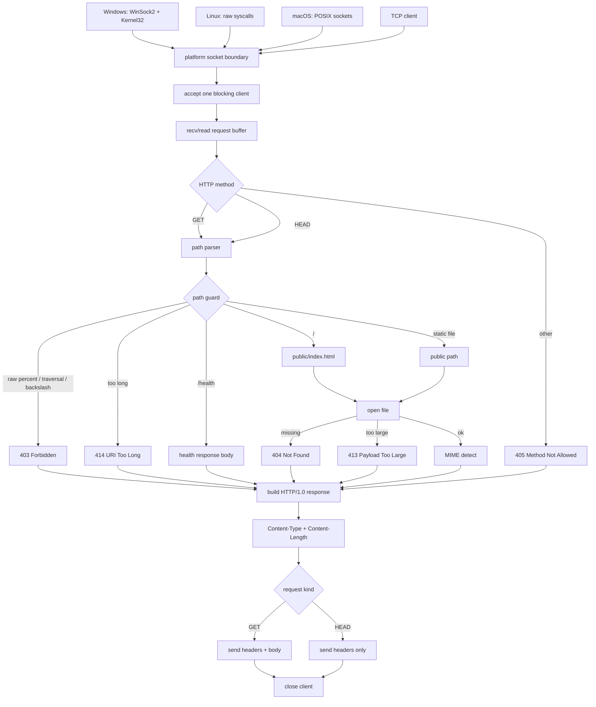

# DEADWIRE HTTPD

A tiny HTTP/1.0 static file server with explicit platform backends.

No HTTP framework. No server library. No hidden runtime layer.

## Current milestone

```txt
DEADWIRE HTTPD v1.0.0 STABLE
```

The v1.0.0 target is the stable static-file core across Windows, Linux, and macOS.

DEADWIRE is intentionally small. It is not a TLS server, not an async framework, and not an internet-facing daemon.

## Platform support

```txt
Windows -> WinSock2 + Kernel32 backend
Linux   -> raw Linux syscall backend
macOS   -> POSIX socket backend
```

The `Makefile` selects the backend automatically:

```txt
Windows_NT -> build/deadwire.exe
Linux      -> build/deadwire
Darwin     -> build/deadwire
```

## Current scope

DEADWIRE does one narrow job:

- bind `127.0.0.1:18080` by default
- accept an optional port argument: `deadwire 19090`
- accept an optional bind argument: `deadwire 19091 127.0.0.1`
- accept `0.0.0.0` when explicitly requested
- accept blocking TCP clients
- parse `GET <path> HTTP/...`
- parse `HEAD <path> HTTP/...`
- serve files from `public/`
- render `/` as `public/index.html`
- return `/health`
- emit explicit `Content-Type` and `Content-Length`
- detect MIME for `.html`, `.htm`, `.txt`, `.css`, `.js`, and `.svg`
- print small structured request trace lines to stdout
- reject unsupported methods with `405`
- reject path traversal with `403`
- reject raw `%` paths until percent-decoding exists
- return missing files with `404`
- close the connection after every response

Example request trace lines:

```txt
access status=200 route=static
access status=200 route=/health
access status=405 reason=method
access status=403 reason=forbidden
access status=404 reason=not-found
```


## Architecture pipeline



## Windows build

Use a Windows toolchain that provides:

- `make`
- GNU assembler: `as`
- `gcc` for PE/COFF linking
- PowerShell

```powershell
make clean
make doctor
make verify
make run
```

Manual tests:

```powershell
build\deadwire.exe
curl.exe http://127.0.0.1:18080/health

build\deadwire.exe 19090
curl.exe http://127.0.0.1:19090/health

build\deadwire.exe 19091 127.0.0.1
curl.exe -I http://127.0.0.1:19091/health
```

## Linux build

Use Linux with:

- `make`
- GNU assembler: `as`
- GNU linker: `ld`
- `curl` for verification

```sh
make clean
make doctor
make verify
make run
```

## macOS build

Use macOS with:

- `make`
- C compiler: `cc`
- `curl` for verification

```sh
make clean
make doctor
make verify
make run
```

The macOS backend is intentionally direct POSIX socket code. It exists to make v1.0.0 tri-platform without pretending that Darwin uses the Linux syscall ABI.

## Verify

```sh
make verify
```

Verification checks:

- `/health` returns `deadwire: ok`
- `/` returns `Content-Type: text/html; charset=utf-8`
- `/hello.txt` returns `Content-Type: text/plain; charset=utf-8`
- `/style.css` returns `Content-Type: text/css; charset=utf-8`
- `HEAD /health` returns headers without a body where that backend supports the v1 request path
- `POST /` returns `405`
- traversal attempts return `403`
- a missing file returns `404`
- structured request trace lines are emitted
- custom port works
- explicit loopback bind works
- explicit any-address bind works
- bad argument cases exit with `fatal: bad arg`
- generated Windows source contains expected release markers

## Current limitations

- single-threaded blocking I/O
- HTTP/1.0 response style
- no TLS
- no keep-alive
- no chunked encoding
- no percent-decoding yet
- max request buffer: 4096 bytes
- max served file size: 65536 bytes
- Windows argument support is generated at build time

## Release tags

```txt
v0.1.0  initial native server
v0.2.0  port arg
v0.3.0  bind arg
v0.4.0  log shape
v0.5.0  HEAD request
v0.6.0  any bind
v0.7.0  bad arg verify
v0.8.0  preflight verify
v0.9.0  release polish
v1.0.0  stable tri-platform core
```

## Core design

Linux path:

```txt
socket -> bind -> listen -> accept -> read -> parse -> openat -> read -> write -> close
```

Windows path:

```txt
WSAStartup -> socket -> setsockopt -> bind -> listen -> accept -> recv -> parse -> CreateFileA -> ReadFile -> send -> closesocket
```

macOS path:

```txt
socket -> setsockopt -> bind -> listen -> accept -> recv -> parse -> fopen -> fread -> send -> close
```

Every platform boundary is explicit.
