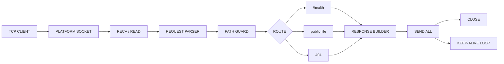

<div align="center">

# DEADWIRE HTTPD

**TINY HTTP/1.0 STATIC SERVER. RAW BACKENDS. NO FRAMEWORK.**

<p>
  
  
  
  
</p>

<p>
  
</p>

</div>

## WHAT IT IS

```txt
DEADWIRE HTTPD IS A SMALL HTTP/1.0 STATIC-FILE SERVER.
NO HTTP FRAMEWORK. NO SERVER LIBRARY. NO HIDDEN RUNTIME LAYER.
```

```txt
WINDOWS -> WINSOCK2 + KERNEL32
LINUX   -> RAW LINUX SYSCALL PATH
MACOS   -> POSIX SOCKET PATH
```

## ARCHITECTURAL PIPELINE



## BUILD

```sh
make clean
make doctor
make verify
make run
```

## WINDOWS BUILD FLAVORS

```txt
build/deadwire.exe                 DEFAULT CLOSE-AFTER-RESPONSE SERVER
build/deadwire_accesslog_off.exe   QUIET CLOSE-AFTER-RESPONSE BENCH SERVER
build/deadwire_keepalive.exe       STABLE OPT-IN KEEP-ALIVE SERVER
```

```sh
make build-quiet
make build-keepalive
make verify-keepalive
```

## V2 DIRECTION

```txt
V1.3.0 IS RELEASED.
V2 TARGETS A REAL NATIVE RUNTIME:
THREAD ABSTRACTION, SYNCHRONIZATION LAYER, WORKER POOL, AND ASSEMBLY-FIRST SERVER CORE.
```

SEE `docs/v2-native-runtime-parity-roadmap.md`.

## SCOPE

```txt
BIND DEFAULT: 127.0.0.1:18080
ARGS:         deadwire [port] [127.0.0.1|0.0.0.0]
METHODS:      GET, HEAD
ROOT:         public/
HEALTH:       /health
STYLE:        BLOCKING, SINGLE-THREADED
```

DEFAULT BEHAVIOR REMAINS CLOSE-AFTER-RESPONSE.
KEEP-ALIVE IS AN OPT-IN WINDOWS BUILD FLAVOR.
THIS IS A CONNECTION-REUSE WIN, NOT A CONCURRENCY FEATURE.

## BENCHMARKS

```sh
make bench-native
make bench-native-quiet
make bench-native-keepalive
```

SEE `BENCHMARKS.md` AND `docs/v1.3-keepalive-native-bench.md` FOR RECORDED RUNS.

## LIMITS

```txt
REQUEST BUFFER: 4096 BYTES
MAX SERVED FILE: 65536 BYTES
NO CHUNKED ENCODING
NO PERCENT-DECODING YET
NOT TLS
NOT ASYNC
NOT CGI
NOT INTERNET-FACING
```

EVERY PLATFORM BOUNDARY IS EXPLICIT.
