<div align="center">

# DEADWIRE HTTPD

**TINY HTTP/1.0 STATIC SERVER. RAW BACKENDS. NO FRAMEWORK.**

<p>
  
  
  
  
</p>

<p>
  
</p>

</div>

## WHAT IT IS

```txt
DEADWIRE HTTPD IS A SMALL HTTP/1.0 STATIC-FILE SERVER.
NO HTTP FRAMEWORK. NO SERVER LIBRARY. NO HIDDEN RUNTIME LAYER.
```

```txt
WINDOWS -> WINSOCK2 + KERNEL32
LINUX   -> RAW LINUX SYSCALL PATH
MACOS   -> POSIX SOCKET PATH
```

## ARCHITECTURAL PIPELINE

```mermaid
%%{init: {"theme": "base", "themeVariables": {"background": "transparent", "mainBkg": "transparent", "clusterBkg": "transparent", "clusterBorder": "#8b949e", "primaryColor": "#0d1117", "primaryTextColor": "#f0f6fc", "primaryBorderColor": "#8b949e", "lineColor": "#8b949e", "fontFamily": "monospace"}}}%%
flowchart LR
    subgraph V1["DEFAULT V1 SERVER PIPELINE"]
        CLIENT["TCP CLIENT"] --> SOCKET["PLATFORM SOCKET"]
        SOCKET --> RECV["RECV / READ"]
        RECV --> PARSE["REQUEST PARSER"]
        PARSE --> GUARD["PATH GUARD"]
        GUARD --> ROUTE{"ROUTE"}
        ROUTE --> HEALTH["/health"]
        ROUTE --> STATIC["public file"]
        ROUTE --> MISS["404"]
        HEALTH --> RESPONSE["RESPONSE BUILDER"]
        STATIC --> RESPONSE
        MISS --> RESPONSE
        RESPONSE --> SEND["SEND ALL"]
        SEND --> CLOSE["CLOSE"]
        SEND --> LOOP["KEEP-ALIVE LOOP"]
    end

    subgraph V2["OPT-IN V2 RUNTIME PROOF PIPELINE"]
        V2BOOT["deadwire_v2_runtime.exe"] --> V2LONG["LONG MODE CONTROLLER"]
        V2LONG --> V2LIVE["OPEN LOOPBACK LISTENER"]
        V2LIVE --> V2COUNT["BOUNDED LOOP TARGET"]
        V2COUNT --> V2TICK["ONE V2 TICK PER REQUEST"]
        V2TICK --> V2ACCEPT["ACCEPTOR HANDOFF"]
        V2ACCEPT --> V2QUEUE["INPUT QUEUE"]
        V2QUEUE --> V2HTTP["HTTP REQUEST STEP"]
        V2HTTP --> V2ROUTE["RUNTIME ROUTE SELECTOR"]
        V2ROUTE --> V2OUT["OUTPUT DRAIN"]
        V2OUT --> V2CHECK["RESPONSE SHAPE CHECK"]
        V2CHECK --> V2STOP["TARGET-REACHED STOP"]
        V2STOP --> V2SHUT["SHUTDOWN PROOF"]
    end

    classDef node fill:#0d1117,stroke:#8b949e,color:#f0f6fc
    class CLIENT,SOCKET,RECV,PARSE,GUARD,HEALTH,STATIC,MISS,RESPONSE,SEND,CLOSE,LOOP node
    class V2BOOT,V2LONG,V2LIVE,V2COUNT,V2TICK,V2ACCEPT,V2QUEUE,V2HTTP,V2ROUTE,V2OUT,V2CHECK,V2STOP,V2SHUT node
    class ROUTE node
    style V1 fill:none,stroke:#8b949e,color:#f0f6fc
    style V2 fill:none,stroke:#8b949e,color:#f0f6fc
```



## BUILD

```sh
make clean
make doctor
make verify
make run
```

## WINDOWS BUILD FLAVORS

```txt
build/deadwire.exe                 DEFAULT CLOSE-AFTER-RESPONSE SERVER
build/deadwire_accesslog_off.exe   QUIET CLOSE-AFTER-RESPONSE BENCH SERVER
build/deadwire_keepalive.exe       STABLE OPT-IN KEEP-ALIVE SERVER
build/deadwire_v2_runtime.exe      OPT-IN V2 LIVE SMOKE RUNTIME
```

```sh
make build-quiet
make build-keepalive
make verify-keepalive
make build-v2-runtime
make verify-triple-thread
```

## V2 STATUS

```txt
V1.3.0 IS RELEASED.
THE DEFAULT SERVER PATH IS STILL THE CLOSE-AFTER-RESPONSE V1 SERVER.
V2 IS OPT-IN AND PROVED BY LOCAL VERIFY GATES.
```

```txt
CURRENT V2 PROOF:
- FIXED RUNTIME SHAPE: SUPERVISOR / ACCEPTOR / HTTP ENGINE
- NO WORKER POOL
- NO THREAD-PER-CONNECTION
- V2 TICK ACCEPTS A LOOPBACK CLIENT AND RUNS THE HTTP REQUEST STEP
- DEADWIRE_V2_RUNTIME.EXE OPENS LOOPBACK, SENDS /HEALTH AND /MISSING PROBE REQUESTS, CHECKS EACH RESPONSE, WRAPS THE QUEUE CURSOR, AND CLOSES CLEANLY
- V2 HEALTH PARITY PROBE CHECKS THE /HEALTH RESPONSE SHAPE USED BY V1
- V2 MISSING RESPONSE PROBE CHECKS THE V1 404 RESPONSE SHAPE
- V2 BOUNDED LOOP TRACKS TARGET, COMPLETED COUNT, AND LAST RESULT
- V2 LONG MODE TRACKS TARGET, COMPLETED COUNT, STOP REASON, LAST RESULT, AND SHUTDOWN RESULT
- V2 SHUTDOWN CHECKS LIVE SOCKET RESET, CLIENT SOCKET SENTINEL, AND IDEMPOTENT LIVE CLOSE
- MAKE VERIFY-TRIPLE-THREAD RUNS THE V2 LIVE SMOKE EXE THROUGH VERIFY-V2FINAL
```

SEE `docs/v2-native-runtime-parity-roadmap.md` AND `docs/v2-triple-thread-runtime.md`.

## SCOPE

```txt
BIND DEFAULT: 127.0.0.1:18080
ARGS:         deadwire [port] [127.0.0.1|0.0.0.0]
METHODS:      GET, HEAD
ROOT:         public/
HEALTH:       /health
STYLE:        BLOCKING, SINGLE-THREADED
```

DEFAULT BEHAVIOR REMAINS CLOSE-AFTER-RESPONSE.
KEEP-ALIVE IS AN OPT-IN WINDOWS BUILD FLAVOR.
THIS IS A CONNECTION-REUSE WIN, NOT A CONCURRENCY FEATURE.

## BENCHMARKS

```sh
make bench-native
make bench-native-quiet
make bench-native-keepalive
make bench-v2-runtime
```

SEE `BENCHMARKS.md` AND `docs/v1.3-keepalive-native-bench.md` FOR RECORDED RUNS.
V2 RUNTIME MICROBENCH NUMBERS ARE LOCAL HANDOFF NUMBERS, NOT PUBLIC SERVER BENCHMARK CLAIMS.

## LIMITS

```txt
REQUEST BUFFER: 4096 BYTES
MAX SERVED FILE: 65536 BYTES
NO CHUNKED ENCODING
NO PERCENT-DECODING YET
NOT TLS
NOT ASYNC
NOT CGI
NOT INTERNET-FACING
```

EVERY PLATFORM BOUNDARY IS EXPLICIT.
