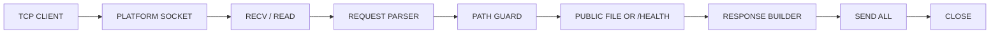

# DEADWIRE HTTPD

A tiny HTTP/1.0 static-file server with explicit platform backends.

No HTTP framework. No server library. No hidden runtime layer.


## Status

```txt
CURRENT: V1.2.0 I/O DISCIPLINE WORK
LATEST RELEASE: V1.1.0 CORE HARDENING
WINDOWS: VERIFIED
LINUX: WIRED
MACOS: WIRED
```

## Backends

```txt
Windows -> WinSock2 + Kernel32
Linux   -> raw Linux syscall path
macOS   -> POSIX socket path
```

## Scope

```txt
bind default: 127.0.0.1:18080
args: deadwire [port] [127.0.0.1|0.0.0.0]
methods: GET, HEAD
root: public/
health: /health
style: blocking, single-threaded, close-after-response
```

DEADWIRE is not TLS, not async, not CGI, not a framework, and not an internet-facing daemon.

## Pipeline



## Build

```sh
make clean
make doctor
make verify
make run
```

On Windows, `make verify` runs the full checked path:

```txt
verify
verify-parser
verify-response
verify-winpath
verify-io
verify-generated-io
verify-port
verify-bind
verify-badarg
verify-preflight
```

## Windows quiet build

The normal Windows binary keeps per-request access logs enabled. For benchmark or local production-style use, build the quiet binary that disables only access-log write sites while keeping banner and fatal output intact.

```sh
make build-quiet
build/deadwire_accesslog_off.exe 18080
```

Benchmarks for the quiet build are tracked in `BENCHMARKS.md`.

## Windows native benches

```sh
make bench-native
make bench-native-long
make bench-native-xl
make bench-native-xxl
make bench-native-lifecycle
make bench-native-quiet
```

## Limits

```txt
request buffer: 4096 bytes
max served file: 65536 bytes
no keep-alive
no chunked encoding
no percent-decoding yet
```

## Core paths

```txt
Linux:   socket -> bind -> listen -> accept -> read -> parse -> openat -> read -> write -> close
Windows: WSAStartup -> socket -> bind -> listen -> accept -> recv -> parse -> CreateFileA -> ReadFile -> send -> closesocket
macOS:   socket -> bind -> listen -> accept -> recv -> parse -> fopen -> fread -> send -> close
```

Every platform boundary is explicit.
