# V2 NATIVE RUNTIME PARITY ROADMAP

DEADWIRE HTTPD V1.3.0 is released, but it is not yet a technical peer of a serious pure-native assembly server.

This roadmap defines the work required to move DEADWIRE from a small blocking static-file server into a real native-runtime HTTP server.

## Truth

```txt
CURRENT STATE:
- blocking, single-threaded request path
- explicit platform backends
- Windows x86-64 assembly path with WinSock2 + Kernel32
- C benchmark tool exists only as tooling
- PowerShell exists only as build/verify glue
- keep-alive is opt-in and sequential

NOT YET TRUE:
- no custom threading runtime
- no custom mutex/futex-style synchronization layer
- no worker pool
- no accept dispatch architecture
- no pure assembly build across the whole product surface
- no multicore scaling claim
```

## Target

```txt
TARGET STATE:
- assembly-first product core
- no C glue in server runtime
- custom native thread abstraction
- custom synchronization primitive layer
- worker-pool accept dispatch
- connection lifecycle owned by DEADWIRE runtime
- deterministic local benchmark harness
- claims backed by tests and measurements
```

The goal is not to cosplay another server. The goal is to earn comparable technical weight through DEADWIRE's own architecture.

## Architecture Target

```mermaid
flowchart LR
    MAIN["MAIN ENTRY"] --> RUNTIME["DEADWIRE RUNTIME INIT"]
    RUNTIME --> NET["PLATFORM NET BACKEND"]
    NET --> ACCEPT["ACCEPT LOOP"]
    ACCEPT --> QUEUE["CONNECTION QUEUE"]
    QUEUE --> WAKE["WAKE WORKER"]
    WAKE --> WORKER["WORKER THREAD"]
    WORKER --> PARSE["REQUEST PARSER"]
    PARSE --> GUARD["PATH GUARD"]
    GUARD --> FILE["STATIC FILE OR HEALTH"]
    FILE --> RESPONSE["RESPONSE BUILDER"]
    RESPONSE --> SEND["SEND ALL"]
    SEND --> CLOSE["CLOSE OR KEEP-ALIVE"]
```



## Milestones

### V2.0: Runtime Boundary

```txt
- split server runtime from platform backend
- define assembly-call ABI for runtime functions
- isolate startup, socket, request, file, response, and shutdown boundaries
- remove accidental coupling between build scripts and server behavior
```

Pass condition:

```txt
make verify
make verify-runtime-boundary
```

### V2.1: Thread Runtime

```txt
- add native thread creation wrapper per platform
- Windows: CreateThread or lower-level documented native path if justified
- Linux: clone path only when tests prove ABI safety
- worker function ABI frozen
- deterministic worker startup/shutdown tests
```

Pass condition:

```txt
worker starts
worker receives job
worker exits cleanly
no leaked handles in local tests
```

### V2.2: Synchronization Layer

```txt
- implement DEADWIRE mutex abstraction
- implement condition/wake abstraction
- Windows candidate: WaitOnAddress/WakeByAddressSingle or event-backed fallback
- Linux candidate: futex syscall path
- no busy-spin default path
- timeout and shutdown behavior tested
```

Pass condition:

```txt
mutex lock/unlock stress passes
wake-one and wake-all tests pass
shutdown cannot deadlock
```

### V2.3: Connection Queue

```txt
- fixed-capacity MPSC or locked ring queue
- accept loop pushes accepted sockets
- worker pool pops sockets
- queue full policy explicit
- graceful close on rejected connection
```

Pass condition:

```txt
queue order is testable
queue full behavior is deterministic
workers cannot double-own a socket
```

### V2.4: Worker Pool Server

```txt
- main thread owns accept loop
- workers own request parsing and response
- close-after-response default preserved
- keep-alive policy remains explicit
- local multicore benchmark introduced
```

Pass condition:

```txt
single-worker mode matches V1 behavior
multi-worker mode passes parser/path/io/response tests
benchmark proves scaling or the claim is not made
```

### V2.5: Assembly-Only Product Runtime

```txt
- server runtime contains no C glue
- C remains allowed only for external benchmark tools
- generated assembly is reviewed or treated as build artifact only
- source layout makes product/runtime/tooling separation obvious
```

Pass condition:

```txt
language stats reflect product core
runtime source audit finds no C server glue
release notes do not overclaim
```

## Non-Goals

```txt
- no TLS in this track
- no CGI in this track
- no async framework
- no third-party HTTP parser
- no public internet hardening claim
- no fake benchmark marketing
```

## Engineering Rules

```txt
TRUTH FIRST.
EVERY CLAIM NEEDS A TEST OR BENCH.
DEFAULT PATH MUST STAY SAFE.
NO FEATURE THAT HIDES THE MACHINE.
NO RUNTIME MAGIC THAT CANNOT BE EXPLAINED AT THE ABI LEVEL.
```

## Immediate Next Step

Start V2.0 by creating a runtime boundary without changing behavior.

```txt
FIRST PATCH:
- document runtime/backend split
- add tests that prove current behavior is preserved
- keep V1.3.0 release untouched
```
