# V2 NATIVE RUNTIME PARITY ROADMAP

DEADWIRE HTTPD V1.3.0 is released. The default server path is still the small blocking HTTP/1.0 server.

V2 is the opt-in native runtime track. It does not get to claim victory because a file exists. It earns the claim by running, failing loudly, and staying measurable.

## Truth

```txt
DEFAULT PRODUCT STATE:
- close-after-response server remains the default path
- Windows x86-64 assembly path still owns the default server
- Linux and macOS paths remain explicit platform backends
- keep-alive remains opt-in and sequential
```

```txt
CURRENT V2 PROOF:
- fixed triple-thread runtime shape: supervisor / acceptor / HTTP engine
- no worker pool
- no thread-per-connection design
- V2 request step takes one queued client, runs the HTTP handler, and completes it
- V2 tick path accepts a loopback client and routes through the request step
- deadwire_v2_runtime.exe runs a bounded multi-request live smoke path and exits nonzero on failure
- V2 health parity probe checks the narrow V1 /health response shape
- V2 bounded smoke loop tracks target count, completed count, and last result
- V2 long-mode controller tracks target count, completed count, stop reason, last result, and shutdown result
- V2 shutdown checks live socket reset, accepted socket sentinel reset, and idempotent live close
- make verify-triple-thread reaches verify-v2final and executes the V2 runtime exe
```

```txt
NOT YET TRUE:
- default server does not run on the V2 runtime yet
- no unbounded V2 listener mode yet
- no full V1/V2 route parity yet
- no multicore scaling claim
- no public internet hardening claim
- no TLS, CGI, async, or framework layer
```

## Target

```txt
TARGET STATE:
- assembly-first product core
- fixed triple-thread runtime
- custom native thread abstraction
- custom synchronization primitive layer
- acceptor owns socket intake
- HTTP engine owns request parsing and response
- connection lifecycle owned by DEADWIRE runtime
- deterministic local benchmark harness
- claims backed by tests and measurements
```

No cosplay. No borrowed glory. The machine either does it or it does not.

## Architecture Target

```mermaid
flowchart LR
    MAIN["MAIN ENTRY"] --> SUP["SUPERVISOR"]
    SUP --> INIT["RUNTIME INIT"]
    INIT --> ACC["ACCEPTOR LANE"]
    INIT --> HTTP["HTTP ENGINE LANE"]
    ACC --> ACCEPT["ACCEPT CLIENT"]
    ACCEPT --> HANDOFF["FIXED HANDOFF / QUEUE"]
    HANDOFF --> HTTP
    HTTP --> RECV["RECV REQUEST"]
    RECV --> PARSE["REQUEST PARSER"]
    PARSE --> GUARD["PATH GUARD"]
    GUARD --> ROUTE["ROUTE"]
    ROUTE --> RESPONSE["RESPONSE BUILDER"]
    RESPONSE --> SEND["SEND ALL"]
    SEND --> CLOSE["CLOSE OR EXPLICIT POLICY"]
```



## Milestones

### V2.0: Runtime Boundary

```txt
- split server runtime from platform backend
- define assembly-call ABI for runtime functions
- isolate startup, socket, request, file, response, and shutdown boundaries
- keep default server behavior unchanged
```

Pass condition:

```txt
make verify
make verify-runtime-boundary
```

Status:

```txt
DONE ENOUGH TO MOVE FORWARD.
```

### V2.1: Fixed Runtime Topology

```txt
- supervisor owns lifetime
- acceptor lane owns intake
- HTTP engine lane owns request work
- no output lane as a fourth runtime thread
- no worker pool
- no thread-per-connection design
```

Pass condition:

```txt
make verify-triple-thread
```

Status:

```txt
ACTIVE AND ENFORCED BY SHAPE PROBES.
```

### V2.2: Request Step

```txt
- queued client enters HTTP request step
- request step calls the runtime HTTP handler
- completed client exits through output queue
- live loopback request probe checks HTTP 200 and body
```

Pass condition:

```txt
make verify-triple-thread
```

Status:

```txt
ACTIVE AND CHAINED INTO VERIFY.
```

### V2.3: Executable Multi-Request Live Smoke

```txt
- build/deadwire_v2_runtime.exe opens a loopback listener
- local peer sends four GET requests, one request per bounded V2 tick
- bounded V2 mode processes each request through the HTTP request step
- response status and body are checked on every request
- queue head/tail cursors wrap back to zero after four requests
- sockets close cleanly
- process exits nonzero on failure
```

Pass condition:

```txt
make build-v2-runtime
.\build\deadwire_v2_runtime.exe
make verify-triple-thread
```

Status:

```txt
ACTIVE. VERIFY-V2FINAL RUNS THE EXE.
```

### V2.4: Shutdown Proof

```txt
- accepted client socket returns to the sentinel after every request
- peer socket is closed and reset in the smoke harness
- live close resets the listening socket to zero
- live close writes a zero last-result on success
- a second live close stays clean
- default server still untouched until parity is proven
```

Pass condition:

```txt
make build-v2-runtime
.\build\deadwire_v2_runtime.exe
make verify-triple-thread
```

Status:

```txt
ACTIVE. SHUTDOWN STATE IS CHECKED BY THE V2 SMOKE EXE.
```

### V2.5: Bounded Loop Proof

```txt
- V2 smoke owns a bounded loop context
- loop target count is explicit
- completed count must reach the target
- last result must end at zero
- failure records the failing result before shutdown
- default server still untouched until parity is proven
```

Pass condition:

```txt
make build-v2-runtime
.\build\deadwire_v2_runtime.exe
make verify-triple-thread
```

Status:

```txt
ACTIVE. LOOP STATE IS CHECKED BY THE V2 SMOKE EXE.
```

### V2.6: Long-Running V2 Mode

```txt
- opt-in executable owns a long-mode controller
- target count is explicit
- completed count must reach the target
- stop reason must be target-reached
- last result and shutdown result must end at zero
- default server still untouched until parity is proven
```

Pass condition:

```txt
make build-v2-runtime
.\build\deadwire_v2_runtime.exe
make verify-triple-thread
```

Status:

```txt
ACTIVE AS A BOUNDED OPT-IN LONG-MODE PROOF. NOT A DEFAULT SERVER CLAIM.
```

### V2.7: Health Parity Probe

```txt
- V2 live smoke sends GET /health
- response status must match the V1 health success shape
- connection-close and content-length headers are checked
- response body must match the V1 health body
- this is not full route parity
```

Pass condition:

```txt
make build-v2-runtime
.\build\deadwire_v2_runtime.exe
make verify-triple-thread
```

Status:

```txt
ACTIVE AS A NARROW /HEALTH PARITY PROBE. NOT A FULL DEFAULT SERVER PARITY CLAIM.
```

### V2.8: Default Server Parity Gate

```txt
- V2 path preserves V1 behavior for /health, /, /hello.txt, /style.css, missing files, method rejection, and path guard
- close-after-response remains default
- keep-alive stays explicit
- benchmark proves scaling or the claim is not made
```

Pass condition:

```txt
make verify
make verify-triple-thread
V1/V2 parity probes pass
release notes do not overclaim
```

## Non-Goals

```txt
- no TLS in this track
- no CGI in this track
- no async framework
- no third-party HTTP parser
- no public internet hardening claim
- no fake benchmark marketing
```

## Engineering Rules

```txt
TRUTH FIRST.
EVERY CLAIM NEEDS A TEST OR BENCH.
DEFAULT PATH MUST STAY SAFE.
NO FEATURE THAT HIDES THE MACHINE.
NO RUNTIME MAGIC THAT CANNOT BE EXPLAINED AT THE ABI LEVEL.
```

## Immediate Next Step

```txt
NEXT PATCH:
- add the next narrow V1/V2 parity probe
- keep default server wording honest
- do not claim full parity until route probes pass
```
