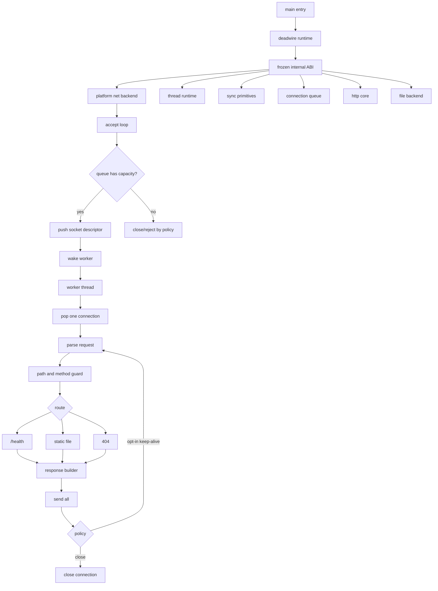

# V2 NIHSERVER SUPERIORITY BAR

This document defines what it means for DEADWIRE HTTPD to become technically stronger than `nihserver` without copying its shape or making unearned claims.

The target is not imitation. The target is an architecture that is smaller where it should be small, stricter where it must be strict, and better instrumented where claims are made.

## Baseline Reference

`nihserver` is a serious reference point because it is a multi-threaded web server written in pure x86-64 Linux assembly with no libc, no dynamic linker, no thread library, no mutex library, and no high-level runtime surface.

Its public design notes describe:

```txt
- pure x86-64 Linux assembly
- no libc / no dynamic linker
- usage shape: nihserver [port] [web_directory] [num_threads]
- blocking I/O
- one thread per connection shape
- clone-based thread creation
- mmap-backed thread stacks
- futex-backed lock primitive
- mostly stack-owned request/file path buffers
```

That is the line DEADWIRE must respect before trying to exceed it.

## Superiority Definition

DEADWIRE is not superior because it has more files, more platforms, more badges, or louder claims.

DEADWIRE is superior only if it satisfies all of the following:

```txt
1. broader product architecture without hiding the machine
2. stricter runtime boundaries than the reference
3. bounded worker-pool dispatch instead of unbounded thread-per-connection shape
4. explicit synchronization layer with tests
5. explicit queue/backpressure policy
6. deterministic local benchmark evidence
7. behavior-preserving migration from V1 to V2
8. safe default network exposure
9. no concurrency or performance claim without verification
10. source layout that separates product runtime, platform backend, generated code, and tooling
```

## Architectural Position

DEADWIRE V1.3 is a verified small static server.

DEADWIRE V2 must become a native runtime beneath the server.



## Where DEADWIRE Must Exceed nihserver

### 1. Runtime Boundary

`nihserver` is impressive because it owns its runtime path directly. DEADWIRE must keep that spirit but add a stricter internal boundary.

DEADWIRE V2 must define callable boundaries for:

```txt
- runtime_init
- runtime_shutdown
- net_listen
- net_accept
- conn_close
- worker_start
- worker_stop
- queue_push
- queue_pop
- mutex_lock
- mutex_unlock
- wake_one
- wake_all
- http_parse
- path_guard
- file_open_readonly
- response_send_all
```

Pass condition:

```txt
make verify-runtime-boundary
```

This test must prove the symbols exist, the documented boundary is current, and the default V1 behavior still passes.

### 2. Threading Model

The reference uses Linux `clone()` and a thread-per-connection style. DEADWIRE should not win by spawning more threads.

DEADWIRE should win by owning a bounded worker-pool dispatch model:

```txt
main thread:
  listen
  accept
  push accepted socket into fixed queue
  wake worker

worker threads:
  wait
  pop socket
  handle request lifecycle
  close or explicit keep-alive
```

Pass condition:

```txt
single worker mode == V1 behavior
multi worker mode passes the same HTTP correctness suite
worker startup/shutdown is deterministic
no accepted socket has two owners
```

### 3. Synchronization

The reference uses a futex-backed lock for Linux logging synchronization. DEADWIRE should generalize this into a platform sync layer.

Windows candidate:

```txt
WaitOnAddress / WakeByAddressSingle when available
Event-backed fallback if required
```

Linux candidate:

```txt
futex syscall path
```

Pass condition:

```txt
mutex stress passes
wake-one passes
wake-all passes
shutdown cannot deadlock
no default busy-spin path
```

### 4. Queue and Backpressure

A bounded queue is the architectural split that makes DEADWIRE more disciplined than naive thread-per-connection designs.

Required design:

```txt
- fixed-capacity connection queue
- deterministic full-queue behavior
- explicit close/reject policy when saturated
- no dynamic allocation in hot accept path by default
- queue counters exposed to benchmark/report tooling
```

Pass condition:

```txt
queue order is testable
queue full behavior is deterministic
socket ownership is single-owner
shutdown drains or closes pending sockets by policy
```

### 5. Benchmark Discipline

DEADWIRE does not get to claim superiority from architecture diagrams.

Required benchmark classes:

```txt
- close-after-response V1 baseline
- V2 single-worker parity
- V2 multi-worker local scaling
- keep-alive opt-in path
- saturated queue behavior
- large static file path
- missing-file path
- health path
```

Each benchmark must report:

```txt
requests
rounds
median_rps
median_avg_ms
bytes
server binary
mode
port
commit sha when possible
```

Claim rule:

```txt
If a benchmark is not in docs or reports, the claim does not exist.
```

### 6. Safety Defaults

DEADWIRE must not become impressive by becoming careless.

Default policy:

```txt
bind: 127.0.0.1
connection mode: close-after-response
thread count: conservative default
keep-alive: opt-in build or explicit option
0.0.0.0: explicit argument only
```

No public-internet hardening claim is allowed in the V2 runtime track.

## Non-Copy Rules

DEADWIRE may learn from `nihserver`, but it must not become a replica.

```txt
DO NOT copy its source structure.
DO NOT copy its prose identity.
DO NOT copy its thread-per-connection endpoint as the final shape.
DO NOT claim superiority from line count.
DO NOT claim assembly purity while hiding C runtime glue in product code.
```

Allowed:

```txt
- study Linux syscall boundary
- study clone/mmap/futex concepts
- implement DEADWIRE's own platform layer
- document every ABI-level decision
- compare with benchmarks only after equivalent tests exist
```

## V2 Milestone Mapping

```txt
V2.0 runtime boundary
  superiority axis: stricter architecture boundary

V2.1 thread runtime
  superiority axis: deterministic worker lifecycle

V2.2 synchronization layer
  superiority axis: portable sync abstraction, no default busy-spin

V2.3 connection queue
  superiority axis: bounded dispatch and backpressure

V2.4 worker-pool server
  superiority axis: multicore architecture with V1 parity gate

V2.5 assembly-only product runtime
  superiority axis: source purity and auditability
```

## First Patch After This Document

Do not begin with a giant rewrite.

Start with the smallest structural cut:

```txt
1. add docs/runtime-boundary.md
2. add make verify-runtime-boundary
3. verify expected runtime symbols/documented boundaries
4. keep HTTP behavior unchanged
5. keep V1.3.0 release behavior untouched
```

The machine earns its name one verified boundary at a time.
