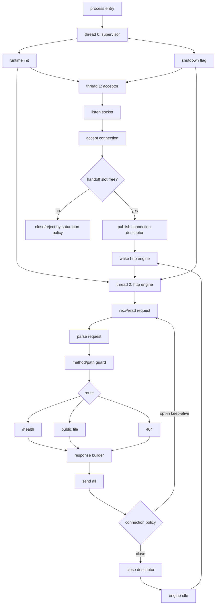

# V2 FIXED TRIPLE-THREAD RUNTIME

DEADWIRE HTTPD V2 is not chasing an unbounded multi-threaded server shape.

The target is a fixed triple-threaded native runtime: three deliberate execution lanes, no framework, no HTTP library, no libc dependency in the product runtime path, and no magic that cannot be explained at the ABI boundary.

## Position

`nihserver` proves that a pure assembly web server can own thread creation, stack allocation, and synchronization directly.

DEADWIRE must not answer that by spawning more threads.

DEADWIRE answers with a stricter shape:

```txt
THREAD 0: SUPERVISOR
THREAD 1: ACCEPTOR
THREAD 2: HTTP ENGINE
```

This is not a worker pool. This is not a thread-per-connection design. This is a fixed runtime topology.

## Thread Roles

### Thread 0: Supervisor

Owns process lifetime and runtime truth.

```txt
- process entry
- config/argument validation
- runtime initialization
- thread startup order
- shutdown signal
- global counters snapshot
- failure state ownership
```

The supervisor does not parse HTTP requests and does not accept connections after runtime startup.

### Thread 1: Acceptor

Owns the listening socket and accepted connection ownership transfer.

```txt
- listen socket
- accept loop
- connection descriptor validation
- fixed connection slot handoff
- saturation policy
- wake HTTP engine
```

The acceptor does not parse HTTP and does not read static files.

### Thread 2: HTTP Engine

Owns the request lifecycle.

```txt
- receive request
- parse request line and method
- path guard
- route health/static/missing
- open/read file
- build response
- send all bytes
- close connection or explicit keep-alive policy
```

The HTTP engine does not accept new sockets directly.

## Runtime Topology



## Handoff Model

The first V2 implementation should use one fixed handoff slot, not a general queue.

```txt
state = empty | full | shutdown
slot.fd
slot.flags
slot.sequence
```

Rules:

```txt
- acceptor is the only producer
- HTTP engine is the only consumer
- descriptor ownership transfers exactly once
- if the slot is full, the acceptor follows the explicit saturation policy
- no dynamic allocation in the handoff path
```

This can later become a bounded ring only if the triple-thread design proves the need. Until then, one slot is easier to audit.

## Synchronization Model

Required primitives:

```txt
- atomic state word
- wait while slot empty
- wake when slot becomes full
- wait while slot full
- wake when slot becomes empty
- shutdown wake
```

Platform candidates:

```txt
Windows: WaitOnAddress / WakeByAddressSingle where available, event-backed fallback if required
Linux: futex syscall path
Darwin: pthread/ulock-style path only if documented and isolated behind platform boundary
```

No default busy-spin path is allowed.

## No-Lib Product Rule

For the product runtime path:

```txt
NO HTTP FRAMEWORK.
NO SERVER LIBRARY.
NO LIBC-OWNED RUNTIME PATH.
NO GENERAL-PURPOSE ALLOCATOR REQUIREMENT IN THE HOT PATH.
NO HIDDEN THREAD LIBRARY AS THE ARCHITECTURE.
```

Allowed platform boundary:

```txt
- direct Linux syscalls
- explicit Windows OS import surface where required
- explicit Darwin platform surface where required
- C benchmark tools outside the product runtime
- PowerShell/shell scripts as build and verification glue only
```

The rule is not aesthetic purity. The rule is auditability.

## Why Fixed Triple-Threaded

A fixed topology has properties that thread-per-connection and generic worker-pool designs do not have by default:

```txt
- deterministic thread count
- deterministic ownership graph
- bounded handoff state
- simpler shutdown proof
- simpler benchmark interpretation
- no false scalability claim from spawning hundreds of threads
- easier assembly-level audit
```

DEADWIRE must be brutal, but it must also be legible.

## Pass Conditions

V2 triple-threaded runtime is not real until these pass:

```txt
make verify
make verify-runtime-boundary
make verify-triple-thread
```

`verify-triple-thread` must prove:

```txt
- exactly three runtime threads are started in the target build
- supervisor starts acceptor before HTTP handoff begins
- accepted descriptor transfers to HTTP engine once
- saturation behavior is deterministic
- shutdown wakes both runtime threads
- V1 HTTP behavior is preserved for /health, /, /hello.txt, /style.css, missing files, method rejection, and path guard
```

## Claim Rule

Do not say DEADWIRE is faster until the benchmark says it.

Do not say DEADWIRE is more scalable until the topology proves it.

Do not say DEADWIRE is pure until product-runtime source audit proves it.

The triple-threaded architecture is the target shape. The proof is still earned by tests.
